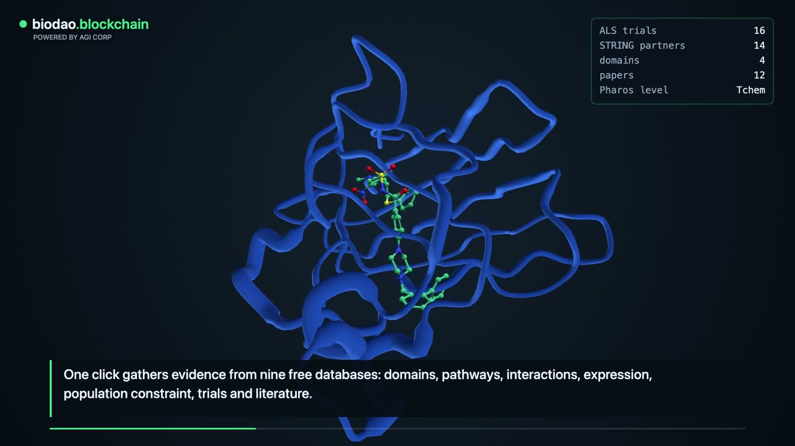
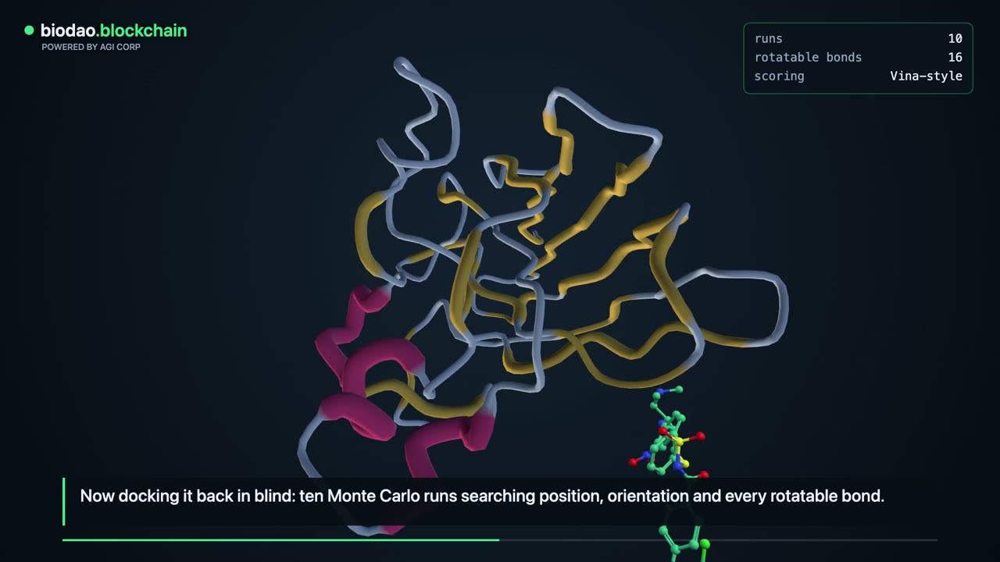
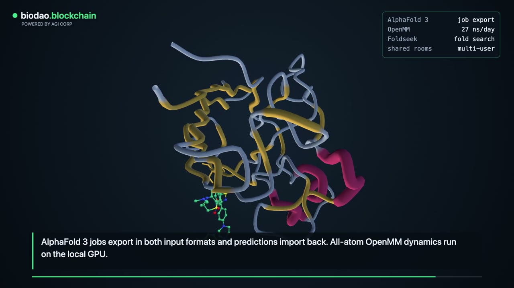
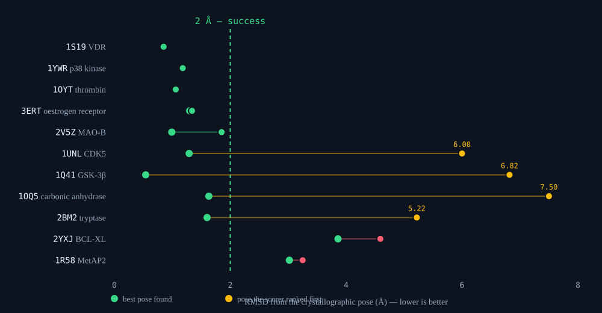
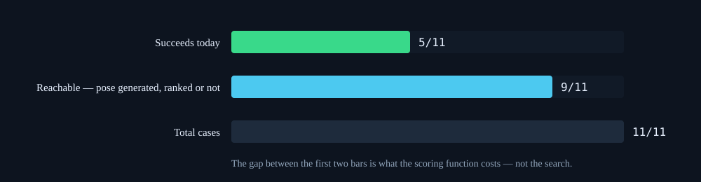
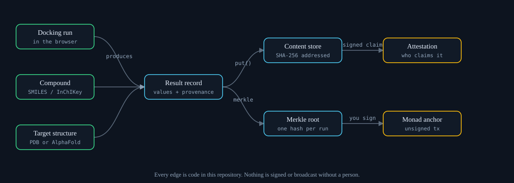

# AGI BioXR — project wiki

A molecular research workspace built on one rule: every number it shows is either traceable to the
thing that produced it, or marked in the output itself as a placeholder.

**Contact — collaboration, review and correction all welcome:** <x@agifuturefoundation.org>

| | |
| --- | --- |
| Whitepaper | [`docs/whitepaper.html`](whitepaper.html) — open in a browser |
| Preview page | [`docs/pitch.html`](pitch.html) |
| Walkthrough video | [`docs/biodao-walkthrough.mp4`](biodao-walkthrough.mp4) (2:08) · [longer cut](walkthrough-share.mp4) (3:02) |
| Spec | [`docs/SPEC.md`](SPEC.md) |
| Status | [`PROJECT_STATUS.md`](../PROJECT_STATUS.md) |
| Repository | <https://github.com/AGIFutureFoundation/AGI-Biotech-tool> |

---

## 1. Start here

```bash
git clone https://github.com/AGIFutureFoundation/AGI-Biotech-tool.git
cd AGI-Biotech-tool
python3.12 -m venv .venv && .venv/bin/pip install -r requirements.txt
make serve                      # http://localhost:8000
```

The app loads SOD1 — the first ALS gene — on open, so there is something real on screen immediately.
To try the headset interface without a headset, open `?emulate=quest3`.

### Every check, one command each

| Command | What it proves | Current |
| --- | --- | --- |
| `make test` | the full suite | 1,265 passing |
| `make imports` | every module under `server/` and `scripts/` imports | 79 passing |
| `make reachable` | no orphaned JS modules | 24 of 24 |
| `make egress` | no undeclared outbound host | 58 declared / 58 found |
| `make trials` | cited trials still say what the panel claims | 126/126 |
| `make citations` | panel identifiers still resolve | network |
| `make llm` | an LLM provider is configured and reachable | optional |
| `node evals/redock.mjs` | docking accuracy, measured | 5/11 within 2 Å |

`make verify` runs test + imports + reachable + egress. The network-dependent checks are deliberately
outside it: a registry outage must not fail an offline build.

---

## 2. What the walkthrough shows



*One action gathers evidence from nine public databases: domains, pathways, interactions, expression,
population constraint, trials and literature.*



*Pocket detection and docking run in the browser; the score updates as the compound moves through
the site.*



*The session ledger — each record chained by hash to the one before it.*

---

## 3. The docking benchmark



Eleven crystal ligands are pulled out of their structures and docked back blind. **Five land within
2 Å.** That is worse than the four-case set it replaced (three of four), and the drop is the point:
with four cases each result was worth 25 points, and those four suited a shape-and-hydrophobicity
score.

### Which half is broken



| Case | Ranked | Best found | Failure mode |
| --- | --- | --- | --- |
| 1UNL · CDK5 | 6.00 Å | **1.29 Å** | scoring |
| 1Q41 · GSK-3β | 6.82 Å | **0.54 Å** | scoring |
| 1OQ5 · carbonic anhydrase | 7.50 Å | **1.63 Å** | scoring |
| 2BM2 · tryptase | 5.22 Å | **1.60 Å** | scoring |
| 2YXJ · BCL-XL | 4.59 Å | 3.86 Å | sampling |
| 1R58 · MetAP2 | 3.25 Å | 3.02 Å | sampling |

Nine of eleven cases are **reachable** — the search generates a pose within 2 Å. Four of the six
failures are poses it found and the scoring function ranked below something wrong. Perfect ranking
over poses already being produced would take the benchmark from 45% to 82% with no change to the
search.

### What the benchmark cannot tell you

Single runs are draws. The same case scored 1.44 Å and 7.50 Å on consecutive runs of identical code,
and three runs of the unmodified benchmark gave 3/11, 5/11 and 6/11. An A/B of a scoring change over
three runs per arm came back **inconclusive** — the effect was roughly ten times smaller than the
spread.

Runs are therefore seedable:

```bash
node evals/redock.mjs --seed 7     # reproducible; both arms see identical draws
```

Without that, noise reads as a result. Baseline run 1 (3/11) against fixed run 1 (6/11) looks like a
doubled success rate and is pure chance.

---

## 4. Provenance



### Placeholders cannot launder themselves

Where no model has run, a value is a *marked* number. The marker survives arithmetic, formatting,
JSON, storage and export, because it is carried by the type rather than by a convention someone has
to remember.

Two defects found by testing this rather than assuming it:

- **`json_default` was dead code.** Its docstring promised that `json.dumps(..., default=json_default)`
  preserved the marker. `default=` is never consulted for a `float` subclass, so every JSON path in the
  repository had been silently stripping it — including content-addressed storage, the component whose
  entire job is provenance.
- **Counts laundered it.** `sum(1 for x in xs if ...)` sums untainted `1`s, so a tally derived from
  placeholders came out clean. A report read *"identified N compounds with favorable binding scores"*
  with every adjacent score marked and the count not.

Both fixed. A count is now re-marked from its inputs:

> Screening of 5 compounds against BCL2 identified **2 [SYNTHETIC]** compounds with favorable binding
> scores.

### Anchoring refuses placeholder data

A Merkle root can be anchored on Monad (mainnet 143, testnet 10143) for a timestamp a third party can
verify. The anchor **refuses** a record containing placeholders — permanence reads as authority, and
"verified on-chain" attached to a stub is a claim that cannot be withdrawn.

No key is ever held. `anchor_payload()` returns an **unsigned** transaction for a person to review and
sign; the software cannot broadcast.

```bash
make anchor RESULTS=run.json      # exit 1 = refused, and that is not an error
```

### Evidence that re-resolves

Disease panels carry verbatim quotes and identifiers, and two scripts re-ask the sources whether each
record still exists and still says what is claimed. `make trials` covers 126 assertions across 46
trial records: that each NCT resolves, that `pediatric_enrollment` matches the registry's own
`stdAges`, and that a status asserted in prose matches `overallStatus`.

A network failure is a **failure**, not a skip. A claim that could not be checked has not been
verified.

---

## 5. Security and data handling

### Exactly one host on page load

Every outbound host is declared with what it is for and what is sent to it, and the build fails on one
that is not. Running it the first time found **26 undeclared hosts**.

Most were harmless in a way worth encoding: `biotech_database_integration.py` is a directory that
*describes* ~40 public databases and contains no HTTP call at all. Lumping those in with real endpoints
would make the inventory look alarming and, worse, untrustworthy — a reviewer who checks one and finds
it never contacted stops believing the whole table. They are a separate category.

The one host contacted on load is a CDN serving the 3D engine. That is the genuine weak point in "runs
locally", and the declaration says so.

### A removed trap

`server/agents.py` carried `execute_bash_job()`, whose docstring read *"Execute a bash command in a
sandboxed environment."* There was no sandbox: `subprocess.run(command, shell=True)` with the server's
full privileges. Nothing called it — the hazard was the docstring. In an agent framework somebody
eventually wants "let the agent run a job", and would have found a helper claiming to be sandboxed.

Removed, with `tests/test_no_shell_execution.py` preventing its return anywhere. The check parses with
`ast` rather than grepping, so the explanatory comment does not trip it.

### Optional integrations are off and honest

| Integration | State |
| --- | --- |
| Wallet sign-in (EIP-4361) | works; `interop_verified: false` — no real wallet has signed |
| Monad anchoring | builds unsigned transactions; `parse_verified: false` — no live node reached |
| x402 pricing | charges, never pays; `settled: false` unconditionally — no facilitator |
| LLM provider | optional; key read from `os.environ` only, never a file |

---

## 6. Optional: an LLM for the agent modules

The repository had **no LLM client**. Its agents are rule-based Python — `predict_synthesis_difficulty`
returns `random.uniform(2.0, 8.0)`. This adds the ability to ask a model for the first time.

```bash
export LLM_API_KEY=your-key          # no angle brackets
export LLM_BASE_URL=https://api.z.ai/api/paas/v4
export LLM_MODEL=glm-5.2
make llm
```

`make llm` reports the endpoint and model, warns on paste mistakes, then asks the model a question it
*should refuse* — the binding affinity of aspirin to BCL2. A good answer names the computation that
would produce the figure.

**A model's answer is a third category.** The repo separates computed values from `[SYNTHETIC]`
placeholders; a language model's judgement is neither, and is the most dangerous of the three, because
a placeholder announces itself while "−8.4 kcal/mol" from a chat model looks exactly like a docking
result. Responses carry a `MODEL-JUDGEMENT` marker.

The key is read from the environment and nowhere else — a test asserts no public function accepts one.

---

## 7. Honest limits

- **Not a validated predictor.** The in-browser score is for ranking and teaching. Not kcal/mol, not
  validated against experiment, not a replacement for Vina or Glide. Eleven cases is a sanity check,
  not a validation study.
- **Not a deployed product.** No cluster, no hosted instance, no user base, no SLA.
- **Not clinical or regulatory.** Not a medical device, no medical advice, and a supplier listing a
  compound is not clearance to obtain or handle it.
- **Not endorsed.** The disease focus reflects design intent. No partnership or sponsorship exists with
  any organisation in those areas.
- **Hardware untested.** Hand tracking and voice have not been validated on Quest 3 or Vision Pro.

---

## 8. Where the next work belongs

1. **Scoring, not search.** Nine of eleven cases are reachable; the ranking is what fails. Now
   measurable, because runs are seedable.
2. **A wider benchmark.** Eleven cases cannot resolve anything below a three-case swing. The Astex
   Diverse Set is 85.
3. **One live MetaMask signature** would move the wallet layer from `interop_verified: false` to
   verified.
4. **Hardware validation** on a real headset.

---

*Questions, corrections, collaboration: <x@agifuturefoundation.org>*
